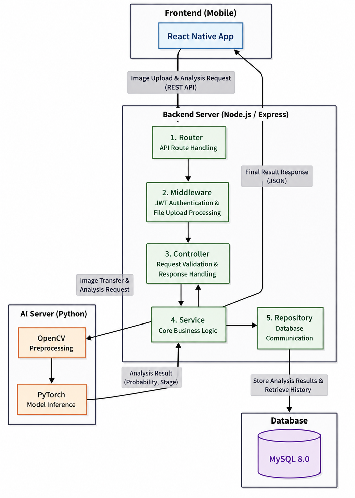

# MOJI
### AI-Based Hair Loss Self-Monitoring System

A **self-monitoring application for scalp and hair loss management** that allows users to capture crown (`crown`) and M-shaped hairline (`m_line`) images, perform AI-based analysis, track historical records, and compare before-and-after results.

**This application is not intended to replace professional medical diagnosis.**

<p align="center">
  
</p>


---

## Implemented Features

### Mobile App (React Native / Expo)

| Feature                     | Description                                                                        |
| --------------------------- | ---------------------------------------------------------------------------------- |
| Login & Registration        | JWT-based authentication (`LoginScreen`)                                           |
| Four-Tab UI                 | Home · Analysis (Upload) · History · Settings                                      |
| Pattern Selection           | Crown / M-line selection (`UploadScreen`)                                          |
| Gallery Upload              | JPG/PNG upload with Base64 conversion after normalization using `ImageManipulator` |
| Guided M-line Capture       | Oval overlay, horizontal alignment, pitch correction (-10°), and guided crop area  |
| Blur Retake Guidance        | `BlurRetakeGuide` provides retake or gallery re-selection options                  |
| Home Summary                | Recent analyses, stage-specific tips, and weekly reminder banner                   |
| History Tracking            | Pattern-specific records, thumbnails, and class progression charts                 |
| Before/After Comparison     | Side-by-side comparison with improvement, maintenance, or deterioration indicators |
| Nearby Clinics & Pharmacies | GPS and address-based search with Naver Map links                                  |
| Medical Disclaimer          | Displayed on Home, Upload, History, and Settings screens (`MedicalDisclaimerCard`) |
| Settings                    | API URL configuration, HTTP/HTTPS guidance, and logout                             |

### Backend (Express + MySQL)

| Feature                | Description                                                                                              |
| ---------------------- | -------------------------------------------------------------------------------------------------------- |
| Authentication         | JWT and bcrypt                                                                                           |
| Upload Validation      | JSON Base64 upload, JPG/PNG only, `.jpeg` extension excluded, file size 8KB–5MB, magic-byte verification |
| AI Integration         | Stores `patternType` and forwards requests to the AI server                                              |
| History API            | `GET /api/analysis/history?patternType=`                                                                 |
| Static File Service    | `/uploads/<filename>`                                                                                    |
| Optional HTTPS Support | Upload APIs can be restricted to HTTPS when `REQUIRE_HTTPS=true`                                         |

### AI Server (FastAPI + EfficientNet)

| Feature             | Description                                                                                                |
| ------------------- | ---------------------------------------------------------------------------------------------------------- |
| Unified Server      | `:8000` supporting both `crown` (3-class) and `m_line` (2-class) classification                            |
| Preprocessing       | Rejects images with Laplacian variance < 80 (422), HSV brightness/saturation correction, 224×224 inference |
| Boundary Adjustment | Crown class-2 boundary correction to class-1 using rule-based logic                                        |

---

## Local Setup

The project is executed using **four separate terminals**. Running all services simultaneously through a single script (`npm run dev`, `dev-all.js`, etc.) is no longer used.

### Prerequisites

* Node.js 20+
* Python 3.11+
* Docker Desktop
* Same Wi-Fi network for PC and mobile device (for physical device testing)

### 1. MySQL

```bash
cd backend
docker compose up -d
```

### 2. AI Server (`:8000`)

```bash
cd ai
python -m venv .venv
.\.venv\Scripts\activate
python -m pip install -r requirements.txt
python api_server.py
```

### 3. Backend (`:3000`)

```bash
cd backend
npm install
npm start
```

### 4. Frontend (Expo)

```bash
cd frontend
npm install
npm start
```

### Verification

| Service  | URL                          |
| -------- | ---------------------------- |
| AI       | http://localhost:8000/health |
| Backend  | http://localhost:3000        |
| Frontend | Expo QR Code                 |

### Example `backend/.env`

```bash
DB_HOST=localhost
DB_PORT=3307
DB_USER=app_user
DB_PASSWORD=app_password
DB_NAME=app_db
AI_SERVER_URL=http://localhost:8000
```

> If MySQL is already using port 3306 on Windows, Docker maps port 3307 to 3306. Update both `docker-compose.yml` and `DB_PORT` accordingly.

---

## Architecture

```text
[App] patternType (crown | m_line)
  → Backend :3000 — Storage, JWT Authentication, History Management
  → FastAPI :8000 — Blur Detection → HSV Correction → EfficientNet Inference
```

* Database tables: `uploads.pattern_type` and `analysis_histories`
* M-line images are cropped on the mobile app before upload
* Gallery uploads follow the same AI inference pipeline without cropping

---

## AI Models

| Pattern Type | Model                                | Description                                               |
| ------------ | ------------------------------------ | --------------------------------------------------------- |
| `crown`      | `ai/bestmodel/best_model.pth`        | 3-class classification                                    |
| `m_line`     | `ai/forhead/best_model_forehead.pth` | 2-class classification (Class 1: Mild, Class 3: Advanced) |

Preprocessing configuration is defined in:

```text
ai/preprocess_config.py
```

HSV recommendations and:

```text
LAPLACIAN_VAR_MIN = 80
```

---

## Database Migration

### PowerShell

```powershell
cd backend
Get-Content -Raw migrations\001_add_pattern_type.sql | docker compose exec -T mysql mysql -uapp_user -papp_password app_db
```

### Bash

```bash
cd backend
docker compose exec -T mysql mysql -uapp_user -papp_password app_db < migrations/001_add_pattern_type.sql
```

---

## Deferred / Not Implemented

| Feature                                     | Status                                              |
| ------------------------------------------- | --------------------------------------------------- |
| Local Push Notifications                    | Removed (`expo-notifications` not used)             |
| M-line Example JPG Modal                    | Not Implemented (replaced by live capture guidance) |
| Crown-Specific Capture Guide                | Limited support                                     |
| Face Blur & Enhanced Guidance               | In progress                                         |
| OpenCV Brightness/Saturation Rejection Gate | Correction only; threshold not finalized            |
| Embedded Map SDK                            | Naver Map links only                                |
| Point / Retention System                    | Not implemented                                     |
| OpenCV Blur Threshold Optimization          | Default threshold 80; additional tuning possible    |

**Legacy Component**

```text
backend/mockAiServer.js
```

Runs on port `:5001` and is no longer used.

---

## Requirement Coverage Summary

### Implemented

* Image capture and upload
* AI analysis
* Historical records
* Before/After comparison
* Medical disclaimer
* Upload validation
* HSV correction
* Blur retake guidance
* Nearby clinic and pharmacy links

### Partially Implemented

* Standardized crown image capture
* Class progression charts (without density/thickness measurements)
* Production HTTPS deployment

### Out of Scope

* Multi-region scalp analysis
* Follicle and hair thickness visualization
* Point and reward systems

---

## Troubleshooting

| Issue                        | Solution                                                                                                                  |
| ---------------------------- | ------------------------------------------------------------------------------------------------------------------------- |
| AI Server `EADDRINUSE :8000` | `netstat -ano \| findstr :8000` → `taskkill /PID <pid> /F`                                                                |
| Upload Timeout               | Ensure AI server and backend are running, connected to the same Wi-Fi network, and Expo `hostUri` is configured correctly |
| Blurry Image Accepted        | Restart the AI server and verify blur-detection preprocessing is enabled                                                  |
