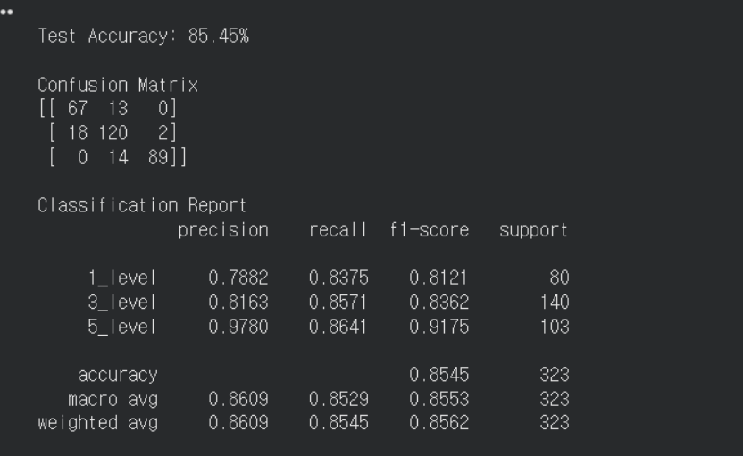

# ai

## ai파트 전체 흐름및 설계작업

## 1. image

ai hub및 roboflow에서 정수리 데이터 셋 확보(약 4500장)

4000장을 먼저 5개의 클래스에 맞게 사진을 검증 및 분류작업 진행 (4500→2155장)

level1: 533  
level2: 516  
level3: 424  
level4: 393  
level5: 289  

(정상에서→탈모순)

but 각 level당 데이터 확보의 어려움이 있어, 5개 클래스에서 3개의 클래스(level 1, level 2+level 3, level 4+level 5)로 구분

정상(클래스 A): 533  
초기~중간(클래스 B): 940  
심화(클래스 C): 682  

초기 구현 생각: 데이터수가 많았다면 처음부터 ai모델을 학습할 생각이였지만, 데이터 분류 작업을 통해 데이터 수를 보았을때 fine tuning을 하는것이 옳은 결정.

따라서 우리는 3개의 클래스로 구분하여 fine tuning으로 ai 모델을 학습할 생각!

## 2. preprocessing

### what

본 프로젝트에서는 스마트폰으로 촬영된 두피 이미지를 CNN 기반 AI 모델 학습에 적합한 형태로 변환하기 위해 이미지 전처리(preprocessing)를 수행하였다. 전처리 과정에서는 RGB 원본 이미지를 유지한 상태에서 이미지 크기 통일, 데이터 증강(Data Augmentation), Tensor 변환 및 정규화를 적용하였다. 또한 학습 데이터와 평가 데이터의 처리 방식을 구분하여 Train 데이터에는 augmentation을 적용하고, Validation 및 Test 데이터에는 공정한 성능 평가를 위해 기본 전처리만 수행하였다.

### why 

이미지 크기를 통일하는 이유는 CNN 모델이 고정된 입력 크기를 요구하기 때문이며, 데이터 형식의 일관성을 유지하기 위함이다. RandomResizedCrop과 augmentation 기법들은 실제 스마트폰 촬영 환경에서 발생할 수 있는 촬영 위치, 거리, 각도, 조명 차이에 대응할 수 있도록 모델의 일반화 성능을 향상시키기 위해 적용하였다. 또한 제한된 데이터셋 환경에서 다양한 입력 패턴을 생성함으로써 overfitting을 완화하고 실제 사용자 환경에 가까운 학습 데이터를 구성하고자 하였다. 마지막으로 정규화(Normalize)는 입력 데이터 분포를 안정화하여 학습 수렴 속도와 성능 향상에 도움을 주기 위해 적용하였다. Validation 및 Test 데이터에 augmentation을 적용하지 않은 이유는 모델 성능을 왜곡 없이 공정하게 평가하기 위함이다.

### how 

먼저 모든 이미지에 대해 Resize를 적용하여 입력 크기를 통일하였다. 이후 학습 데이터에는 RandomResizedCrop을 적용하여 이미지의 다양한 위치와 비율 정보를 학습에 반영하였다. 또한 스마트폰 촬영 환경의 다양성을 반영하기 위해 HorizontalFlip, Rotation, ColorJitter를 적용하여 좌우 방향 변화, 회전, 밝기 및 대비 변화를 포함한 데이터를 생성하였다. 마지막으로 ToTensor를 통해 이미지를 PyTorch Tensor 형태로 변환하고, Normalize를 적용하여 픽셀 값을 정규화하였다. 반면 Validation 및 Test 데이터에는 augmentation을 적용하지 않고 Resize, CenterCrop, ToTensor, Normalize만 적용하였다.

## 3. feature extraction(fine tuning)

### what

본 프로젝트에서는 이미지 feature extraction을 위해 PyTorch 기반의 pretrained CNN 모델인 EfficientNet-B0를 사용하였다. EfficientNet-B0는 ImageNet 데이터셋으로 사전 학습(pretrained)된 모델로, 이미지의 edge, texture, pattern과 같은 기본적인 시각적 특징을 이미 학습한 상태이다. 본 프로젝트에서는 pretrained 모델을 그대로 사용하는 것이 아니라 탈모 이미지 데이터셋에 맞게 fine-tuning을 수행하였다. 또한 기존 classifier 구조를 수정하여 탈모 단계를 분류하는 3-class classification 모델로 재구성하였다.

### why

초기에는 CNN 모델을 처음부터 학습(scratch training)하는 방식을 고려하였으나, 데이터 정제 이후 실제 사용 가능한 이미지 수가 약 2131장 수준으로 감소하였기 때문에 충분한 학습 데이터를 확보하기 어려웠다. CNN을 처음부터 학습할 경우 대량의 데이터가 필요하며, 데이터 수가 부족하면 overfitting이 발생할 가능성이 높다. 따라서 이미 대규모 이미지 데이터셋(ImageNet)으로 학습된 pretrained 모델을 활용하여 transfer learning 및 fine-tuning을 수행하는 방식이 더 적절하다고 판단하였다. 또한 EfficientNet-B0는 비교적 적은 파라미터 수로도 높은 성능을 제공하기 때문에, 제한된 데이터 환경에서도 효율적인 feature extraction과 안정적인 학습이 가능하다는 장점이 있다.

### how

먼저 ImageNet으로 pretrained된 EfficientNet-B0 모델을 불러온 뒤, 기존의 1000-class classifier layer를 제거하고 탈모 단계 분류를 위한 3개의 output node를 가지도록 classifier를 수정하였다. 이후 수정된 모델에 대해 탈모 이미지 데이터셋을 사용하여 fine-tuning을 수행하였다. 학습 과정에서 모델은 상단부 두피 이미지로부터 모발 밀도(hair density), 두피 노출 정도(scalp exposure), 모발 간 간격(hair spacing), 모발과 두피 사이의 contrast, thinning pattern 등의 특징을 자동으로 추출하도록 학습되었다.

## 4. classification(확률 값)

### what

Feature extraction 과정을 통해 추출된 특징 벡터(feature vector)는 마지막 classification layer를 통해 탈모 단계를 분류하는 데 사용된다. 본 프로젝트에서는 탈모 상태를 정상(Class A), 초기~중간 탈모(Class B), 심화 탈모(Class C)의 총 3개 클래스로 구성하였다. 모델의 최종 출력은 각 클래스에 대한 score(logit) 형태로 생성되며, 이후 Softmax 함수를 통해 확률값으로 변환된다.

### why

본 프로젝트에서 Softmax 기반 확률 출력 방식을 사용한 이유는 단순히 하나의 클래스만 반환하는 방식보다 모델의 판단 신뢰도를 함께 제공할 수 있기 때문이다. 사용자는 단순 결과뿐만 아니라 모델이 특정 클래스를 얼마나 높은 확률로 판단했는지를 확인할 수 있으며, 이를 통해 경계 구간에 있는 이미지나 모호한 예측 상황도 보다 직관적으로 해석할 수 있다. 또한 확률 기반 출력은 이후 후처리(post-processing) 규칙 적용이나 사용자 결과 UI 구성에도 활용할 수 있다는 장점이 있다.

### how

EfficientNet-B0의 마지막 feature vector는 fully connected classification layer에 입력되며, 이 layer는 3개의 클래스에 대한 출력값을 생성한다. 이후 Softmax 함수를 적용하여 각 클래스가 선택될 확률을 계산하였다. 예를 들어 출력 결과가 정상 0.12, 초기~중간 탈모 0.71, 심화 탈모 0.17로 나타난 경우, 가장 높은 확률값인 0.71을 가진 초기~중간 탈모(Class B)로 최종 예측하게 된다. 이 과정에서 모든 클래스 확률의 합은 1이 되도록 정규화된다.

## 5. 모델 성능(85.45%)

## 6. service.py(ui)

중요!!!→ 클래스를 구분할때 정상 클래스와 의심 클래스의 경계가 모호하다.

따라서 아래와 같은 조건을 통해 1단계와 3단계의 경계를 구분한다.

3단계라고 예측했지만

3단계 확률 50~60%  
5단계 확률 10% 미만  
1단계 확률 30% 이상  

→ 1단계로 보정

반면 3단계라고 예측했지만 하나라도 저 rule을 만족하지 않는다면 원래 예측한 값으로 확정

이를 통해 1단계와 3단계의 경계를 구분 짓는다.

